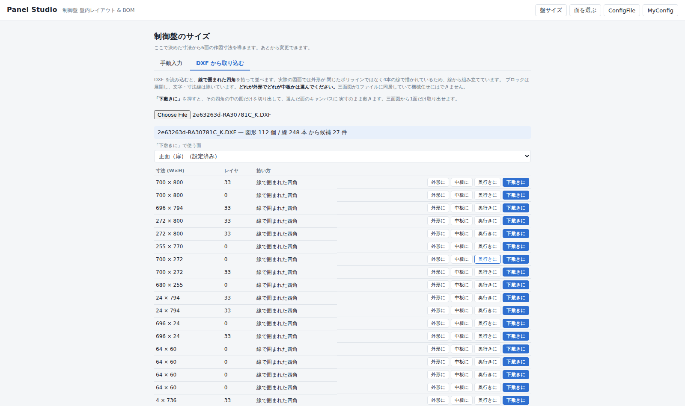
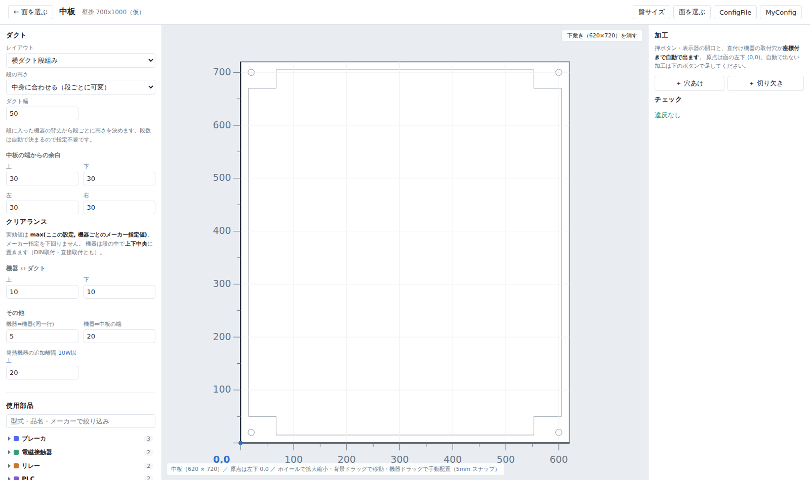
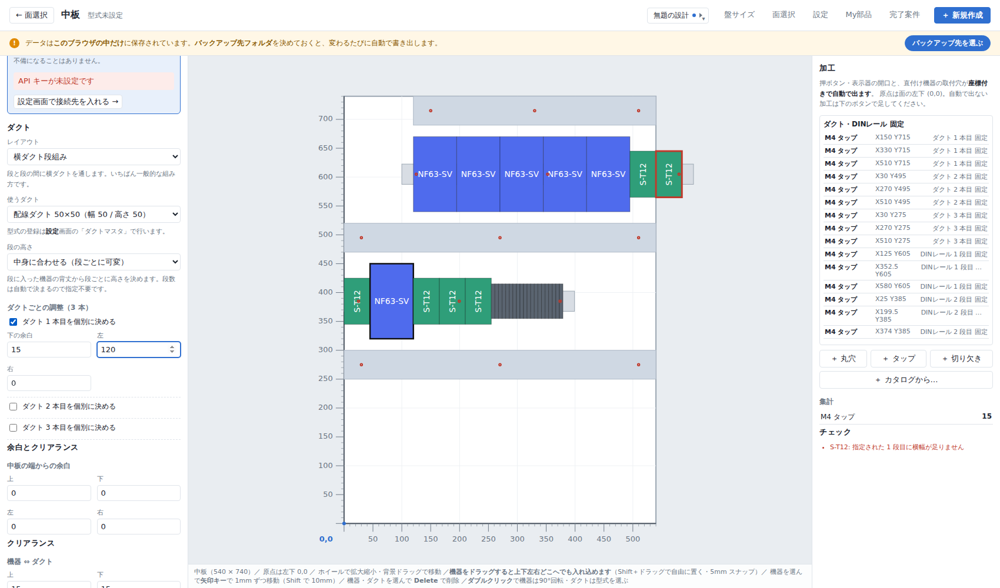
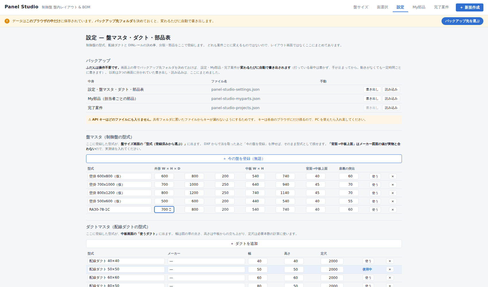
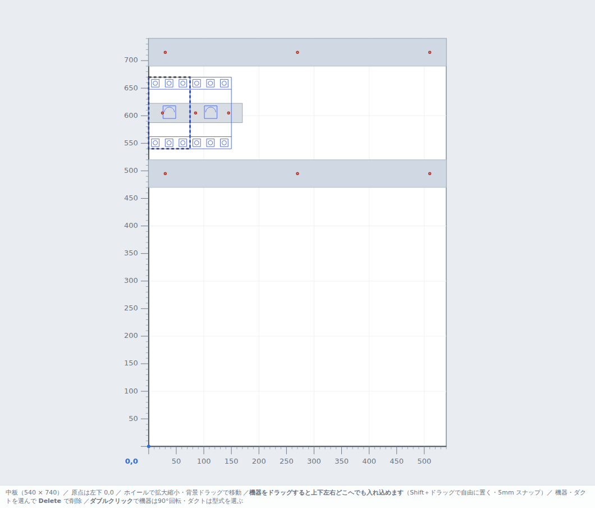
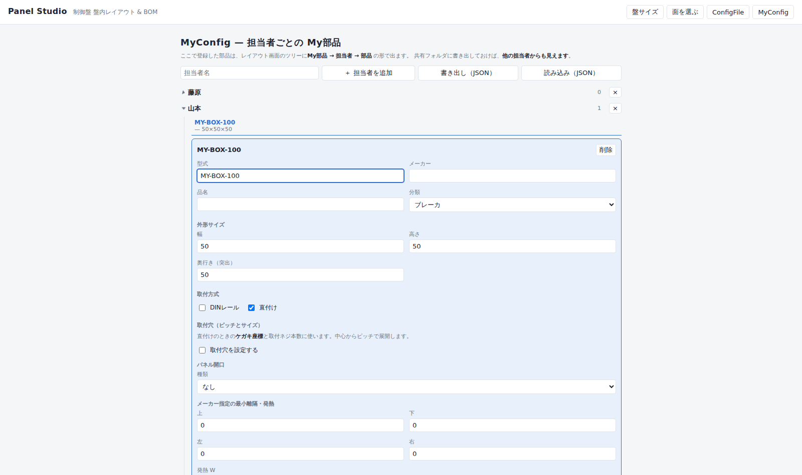

# Panel Studio

制御盤の**盤内レイアウト自動配置**と**BOM 自動生成**を行う Web アプリです。
機器と個数を選ぶだけで、盤面レイアウトと部品表が同時に出ます。

- 100% ブラウザ動作（サーバー不要・インストール不要）
- CSV 書き出し（部品表・加工リスト）。文字コードは Shift-JIS / UTF-8 を選択可
- 開発環境: Node.js + React + TypeScript (Vite)

## 起動方法

```bash
npm install     # 初回のみ
npm run dev     # 開発サーバー → http://localhost:5173
```

配布用ファイルを作る場合:

```bash
npm run build:single   # release/panel-studio.html を出力（HTML 1ファイル）
```

出力された HTML 1ファイルを共有フォルダに置けば、ダブルクリックで開けます。

## 設計の要点

| 項目 | 方針 |
| --- | --- |
| 機器マスタ | **唯一の情報源**。レイアウトと BOM の両方がここを参照し、同期崩れを防ぐ |
| 座標系 | 各面の左下を原点 (0,0)、X 右・Y 上、単位 mm |
| CAD 連携 | AutoCAD LT は COM/ActiveX 自動化に非対応のため、ファイル受け渡しで連携する |
| 配置アルゴリズム | 決定論的 greedy。最適詰込みは**あえてやらない**（「主幹は上段・端子台は下段」という人間のルールから外れると使われなくなる） |
| 安定配置 | 手で動かした機器は `pinned` として座標を保持。機器を1台足しても既存配置が組み替わらない |
| クリアランス | 実効値 = `max(グローバル設定, 機器個別のメーカー指定値)`。メーカー指定を下回らせない |
| 奥行き判定 | 「中板上面 → 扉内面」の有効奥行きで干渉を見る。DIN レール取付時はレール高さを加算 |

## 画面の流れ

```
盤サイズ（手動入力 / DXF取り込み）
      ↓
面を選ぶ（6面・三角法の並び）＋ 盤全体の BOM・CSV
      ↓
レイアウト詳細（面ごと）

別画面: ConfigFile（共通の部品表） / MyConfig（担当者ごとの My部品）
```

### 盤サイズ

最初の画面で制御盤の寸法を確定させます。**手動入力**と **DXF 取り込み**が選べます。

DXF を読み込むと、**線で囲まれた四角**を拾って並べます。**どれが外形でどれが中板かは人が
選びます。** メーカー図面は三面図が1ファイルに同居していて機械任せにはできないためです。

実際のメーカー図面を読ませて分かったこと（実装はこれに合わせてあります）:

| 実データの事情 | 対応 |
| --- | --- |
| 外形の四角が**閉じたポリラインではなく4本の LINE** で描かれている | 線を集めて四角を組み立てる |
| 三面図が1ファイルに同居し、レイヤでは分かれていない | 離れて描かれた図を「かたまり」に分ける |
| 部品の形が**ブロックの中**にあり INSERT で置かれている | ブロックを展開する（回転・倍率も反映） |
| 文字が図の外にあり、外接を取ると寸法が狂う | TEXT / MTEXT / 寸法線を除く |
| 文字コードが Shift-JIS | 文字コードを判定して変換する |

`BASE-W620H720-3.dxf` は候補1件（**620 × 720**）、
`RA30781C_K.DXF` は正面 700×800・側面 272×800・上下面 700×272 が候補として並びます。



### DXF をキャンバスの下敷きにする

候補の「**下敷きに**」を押すと、その四角の中の図だけを切り出して、選んだ面のキャンバスに
**実寸 1:1 のまま**敷きます。三面図から1面だけ取り出せます。
面の大きさに引き伸ばさないのは、図が歪むうえ、寸法が合っていないことに気づけなくなるためです。



### 面を選ぶ

**左に面の選択、右に BOM と CSV** の2列です。
6面（上面／左側面／正面（扉）／右側面／底面／中板）を**三角法**の並びで置いています。
BOM は面ごとではなく盤単位のものなので、6面ぶんをまとめてこの画面に出します。

| 面 | 扱い |
| --- | --- |
| 中板 | 配線ダクト＋DIN レール。自動段組みの対象 |
| それ以外の5面 | 直接取り付けのみ。穴あけ・切り欠き加工の対象 |

### レイアウト詳細

面によって左ペインの中身が変わります。

| | 左ペイン | 右ペイン |
| --- | --- | --- |
| 中板 | ダクト・クリアランス・使用部品 | 加工・チェック |
| 中板以外 | **座標（中心）**・使用部品 | 加工・チェック |

キャンバスの縦横に**目盛り**が出ます。**原点は左下 (0,0)** です。

#### 機器の並べ替え

- 使用部品は **「＋」で増やした順**にそのまま並びます（カテゴリ順の並べ替えはしません）
- **機器をドラッグすると、他の機器の間に入り込みます。** 並び順が変わって配置がその場で組み直されるので、
  ドロップ先の目印を別に出す必要がありません
- **Shift＋ドラッグ**で従来どおり座標を自由に決めて固定できます（5mm スナップ）



### ConfigFile / MyConfig

- **ConfigFile** — 共通の部品表。分類の追加・改名・色変更と、部品の登録・編集。
  部品には**取付穴のピッチと穴径**、パネル開口、メーカー指定の最小離隔、発熱を持たせます。
  **DXF を読み込むと、ただの四角ではなく実際の形で描きます**（下記）。
- **MyConfig** — 担当者ごとの My部品。レイアウト画面のツリーに
  **My部品 → 担当者 → 部品** の形で出ます。**他の担当者からも見えます。**

どちらも JSON で書き出し・読み込みできます。共有フォルダに置いて全員で同じものを使う想定です。



### 部品を CAD の形で描く

部品編集の「外形線（CAD から取り込む）」に DXF を読み込むと、その部品を
**ただの四角ではなく実際の形**で描きます。

- 寸法線・文字・ハッチ・中心線は落とし、外形線だけを取り込みます
  （レイヤ名に `dim` `寸法` `text` `文字` などを含むものと、DIMENSION / TEXT / HATCH の類）
- 取り込んだ**外接寸法がそのまま外形サイズ**になります。あとから数値で直せます
- 円弧は折れ線に置き換えています。Y を反転した座標系では SVG の円弧フラグの向きが
  逆になり、取り違えると弧が裏返るためです
- 形状は分類の色で描かれ、面いっぱいに拡縮されます。線の太さは拡大しても一定です



⚠ メーカー配布の DXF は再配布が禁止されています。取り込んだ形状は各自の
ConfigFile / MyConfig の JSON に入るだけで、アプリには一切同梱していません。



## 動くもの

- 盤サイズの手動入力と DXF 取り込み
- 6面の選択と、面ごとのレイアウト
- 機器の選択（折りたためるツリー＋絞り込み検索、My部品の枝つき）
- **「＋」で増やした順に配列。ドラッグで他の機器の間に入れ込める**
- 横ダクト段組みの自動配置（段の高さを中身から決める／全段そろえる の2モード）
  - DIN 取付・直接取付とも段の中で**上下中央合わせ**
- キャンバスの目盛り（原点は左下 0,0）、ドラッグでの手動配置、座標（中心）の直接入力
- 加工（穴あけ・切り欠き）
  - 押ボタン・表示器の**開口**と、直付け機器の**取付穴**を座標付きで自動導出
  - どの機器から出た加工かが分かるよう、使用機器ごとにまとめて表示
  - **バカ穴（径指定）とタップ穴（M3/M4/M5/M6）を切り替え可能。** タップは下穴径を自動で入れ、
    加工リスト CSV には「ねじ」列に呼びが出ます
  - 手動で足した加工は**1行に畳めます**。選ぶとキャンバス上でオレンジに強調されます
  - 寸法ごとの集計
- 違反表示（段の高さ不足・幅不足・奥行き干渉・扉裏の突出超過・機器同士の重なり）
- BOM（盤全体、機器本体＋派生部品：DIN レール切断長、ダクト定尺本数と端材、
  エンドストッパ、取付穴の数から出した取付ネジ）
- CSV 書き出し（部品表／加工リスト）
- **部品の外形線を DXF から取り込み、実形状で描画**
- ConfigFile・MyConfig の JSON 書き出し・読み込み

## 未実装

- ダクトレイアウトの残り4パターン（縦ダクト両サイド／田の字／ゾーン分割／端子台最下段）
- BOM の xlsx 出力
- 盤マスタ（型式ごとの寸法）の保存
- Undo / Redo

## CSV 書き出しについて

- **部品表 CSV** と **加工リスト CSV** の2種類を出します。
- 文字コードの既定は **Shift-JIS (CP932)**。国内 ERP は Shift-JIS 指定のことが多いためです。
  UTF-8（BOM 付き）にも切り替えられます。
- 区切り文字と見出し行の有無も切り替えられます。ERP の取込仕様が判明したら、
  **コードを触らず設定を変えるだけ**で合わせられる作りにしてあります。
- 改行は ERP 取込で要求されることが多い CRLF です。
- ダウンロードのファイル名は ASCII のみで組み立てています。非 ASCII を含む名前は
  ブラウザ・OS のロケール次第で丸ごと捨てられ `download` になることがあるためです。

## DXF 書き出しについて

**一旦取り下げています。** 実装済みでしたが、仕様の見直しにより削除しました。
コードは Git 履歴に残っているので復活できます（DXF R12 / 実寸 mm / Shift-JIS / レイヤ名は設定可）。

## データについて

⚠ `src/data/` のサンプル寸法は**すべて仮値**です。実案件で使う前に、メーカーのカタログと
図面データで実寸を確認して差し替えてください。

⚠ メーカー配布の DXF/DWG は**再配布が禁止**されています。このリポジトリには寸法（数値）
だけを持ち、図面ファイルは同梱しません。各自がメーカーサイトからダウンロードして
アプリに読み込む運用にします（`.gitignore` で `*.dxf` / `*.dwg` を除外済み）。

## ドキュメント

- [仕様レビューと技術判断](docs/01-spec-review.md)
- [既存図面から読み取った作図規則](docs/02-drawing-conventions.md)
- [引き継ぎ用の元仕様書](docs/00-original-spec.md)

※ `docs/01-spec-review.md` は検討時点の記録のため、取付板を「基板」と表記しています。
実際の図面の表記に合わせ、以降は**「中板」**を正式な呼称とします。
