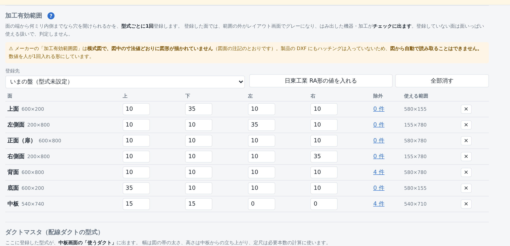
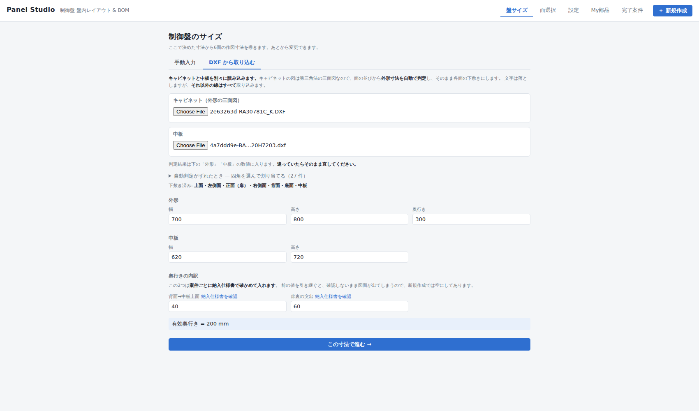
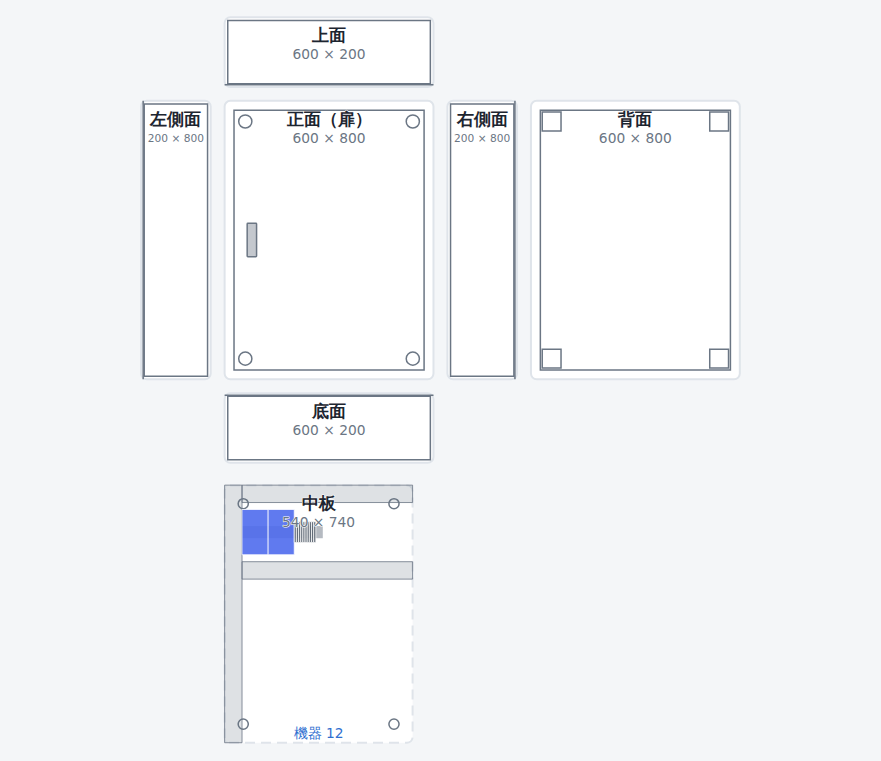
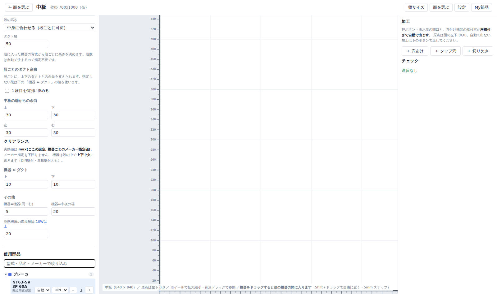
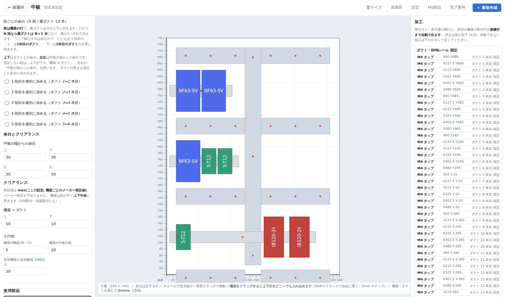
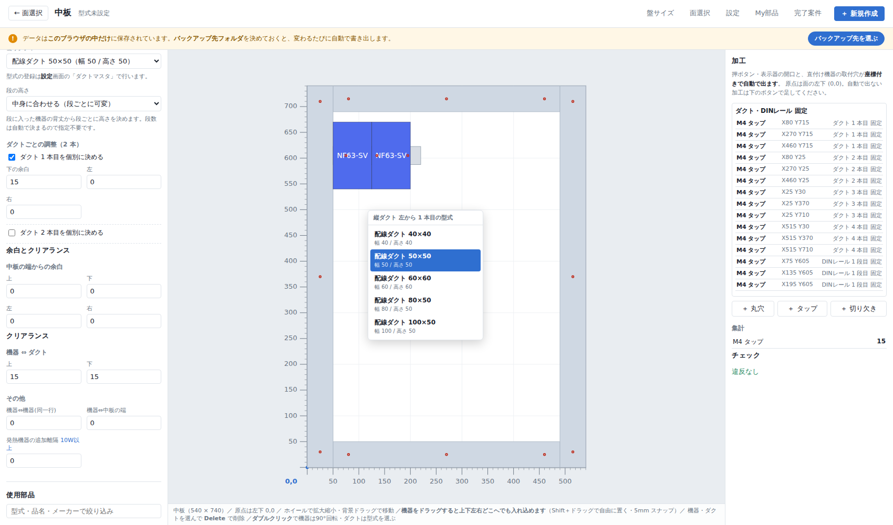
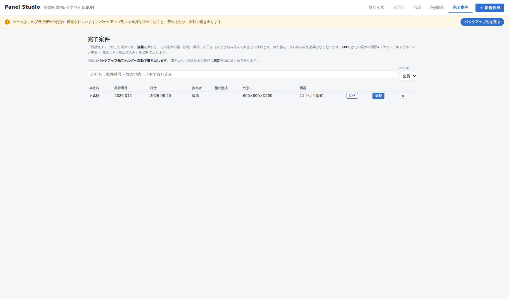
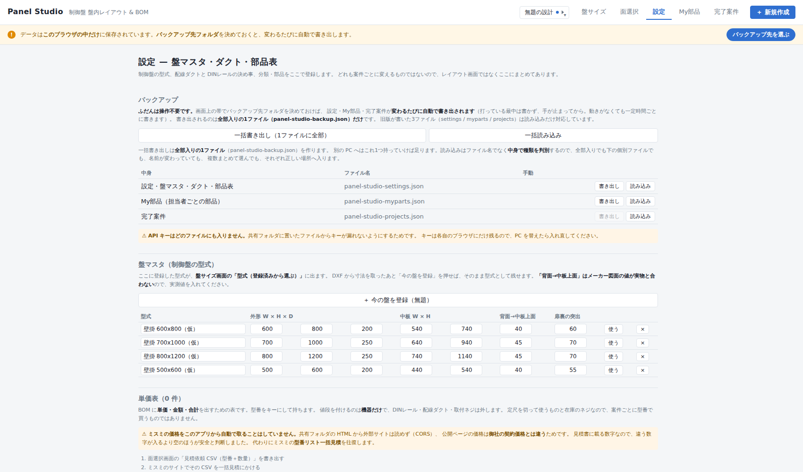

# Panel Studio

制御盤の**盤内レイアウト自動配置**と**BOM 自動生成**を行う Web アプリです。
機器と個数を選ぶだけで、盤面レイアウトと部品表が同時に出ます。

- 100% ブラウザ動作（サーバー不要・インストール不要）
- CSV 書き出し（部品表・金額つき部品表・見積依頼）。文字コードは Shift-JIS / UTF-8 を選択可
- 開発環境: Node.js + React + TypeScript (Vite)

## 起動方法

```bash
npm install     # 初回のみ
npm run dev     # 開発サーバー → http://localhost:5173
```

配布用ファイルを作る場合:

```bash
npm run build:single   # release/panel-studio.html を出力（HTML 1ファイル）
```

出力された HTML 1ファイルを共有フォルダに置けば、ダブルクリックで開けます。

## 設計の要点

| 項目 | 方針 |
| --- | --- |
| 機器マスタ | **唯一の情報源**。レイアウトと BOM の両方がここを参照し、同期崩れを防ぐ |
| 座標系 | 各面の左下を原点 (0,0)、X 右・Y 上、単位 mm |
| CAD 連携 | AutoCAD LT は COM/ActiveX 自動化に非対応のため、ファイル受け渡しで連携する |
| 配置アルゴリズム | 決定論的 greedy。最適詰込みは**あえてやらない**（「主幹は上段・端子台は下段」という人間のルールから外れると使われなくなる） |
| 安定配置 | 手で動かした機器は `pinned` として座標を保持。機器を1台足しても既存配置が組み替わらない |
| クリアランス | 実効値 = `max(グローバル設定, 機器個別のメーカー指定値)`。メーカー指定を下回らせない |
| 既定の余白 | **0 から始める**（機器⇔ダクトの上下だけ 15）。勝手に空きを取ると図面が実物と食い違うため |
| 奥行き判定 | 「中板上面 → 扉内面」の有効奥行きで干渉を見る。DIN レール取付時はレール高さを加算 |

## 画面の流れ

```
盤サイズ（型式から選ぶ / 手動入力 / DXF取り込み）
      ↓
面選択（7面・三角法の並び）＋ 盤全体の BOM・CSV ＋ 設計完了
      ↓
レイアウト詳細（面ごと）

別画面: 完了案件 / 設定（盤マスタ・ダクトマスタ・部品表） / My部品（担当者ごと）
```

画面の移動は右上のタブで行います。**新規作成だけは移動ではなく操作**なのでボタンで分けています。

### 加工有効範囲

メーカーの盤には**面のどこにでも穴を開けられるわけではない**制約があります
（端から 10mm は折り返しで開けられない、背面はボルトホルダーを避ける、など）。
日東工業なら「加工有効範囲図【レーザー】BOX-LASER-〇〇 / BASE-LASER-〇〇」がそれです。

**この図から自動で読み取ることはできません。** 図面自身にこう注記があります。

> 当図は模式的に加工可能範囲を示すもので、図中の寸法値通りに図形が描画されていません。
> CADデータとしてはお使い頂けませんのでご了承下さい。

つまりハッチングの形は実寸ではなく、正しいのは寸法値だけです。製品の DXF のほうには
ハッチングが入っていません（別図面です）。読み取りで解決できる話ではないので、
**数値を型式ごとに1回だけ登録して使い回す**形にしました。端からの入り込みは
盤の大きさが変わっても同じ値なので、シリーズ単位で効きます。

設定画面の「加工有効範囲」で、面ごとに

- **上下左右の入り込み**（面の端から何ミリ内側までなら開けられるか）
- **除外する矩形**（ボルトホルダー、中板四隅の取付ボルトなど）

を登録します。除外の位置は**角からの距離**で持つので、盤の大きさが変わっても付いてきます。

登録した面では、レイアウト画面で**使えない部分がグレー**になり、範囲の境界が破線で出ます。
そこからはみ出した機器・加工は**チェックに出ます**。板金屋に出してから断られるのが
一番高くつくので、図の上で止めます。

**登録していない面は判定しません**（面いっぱい使える扱い）。分からないものを禁止扱いにすると、
人は表示ごと無視するようになるためです。

「日東工業 RA形の値を入れる」で RA形（片扉）の値をまとめて入れられます。
これはメーカーの加工有効範囲図から**数値だけ**を写したもので、正解の保証ではありません。
案件の納入仕様書と突き合わせてから使ってください。



#### 図面を横に置いて打つ

数値を打つあいだ、別ウィンドウの PDF とアプリを行ったり来たりするのが面倒なので、
**加工有効範囲図の PDF をそのまま取り込んで**入力欄の下に出せるようにしました。
図は型式と一緒に保存するので、次からは開き直す必要がありません。

取り込むのは**表示のためだけ**です。前述のとおり形は実寸ではないので、
線から範囲を読み取ることはしていません。PDF の中のベクタ線を SVG に描き直すので、
拡大しても寸法値が読めます（画像に焼くと読めなくなります）。

どの PDF を落とせばいいかは、見出しの `?` に載せると出ます。メーカーの図面ダウンロード
画面の**「穴加工用図面」の PDF** です（納入仕様書のほうではありません）。
盤サイズ画面の「奥行きの内訳」にも同じ `?` があり、断面の絵で
「背面→中板上面」と「扉裏の突出」がどこを指すかを示します。

### バックアップ

データはブラウザの中にしかありません。ブラウザの履歴を消したり PC を入れ替えたりすると、
盤マスタも部品表も完了案件も一緒に消えます。

画面上部の帯で**バックアップ先フォルダを1回決めておくと、あとは中身が変わるたびに自動で
書き出します**。「書き出し（JSON）」を人が押して回る運用は、押し忘れた日のぶんが消えるので
やめました。フォルダの指定は Chrome / Edge の File System Access API を使い、
指定したフォルダは IndexedDB に覚えるので、次に開いても同じ場所に書き続けます。

- 打っている最中は書かず、**手が止まってから**（3秒）まとめて書きます
- 変更が続いても放置されないよう、**60秒ごと**にも書きます。閉じる前にも書きます
- 選んだフォルダに既にファイルがあれば、**読み込むか聞きます**。
  新しい PC で開いた直後に、空の状態でフォルダを上書きしてしまうのを防ぐためです
- 書き出し・読み込みの手動操作は、3画面に散らばっていたものを**設定画面の1つの表**に
  まとめました。ふだんは操作不要で、別の PC へ持っていくときだけ使います
- **API キーはどのファイルにも入りません。** 共有フォルダから漏れるためです

**「＋ 新規作成」**で盤・機器・加工・下敷きを白紙に戻します。
マスタ（盤・ダクト・部品）と設定、完了案件はそのまま残ります。
作りかけがあるときだけ確認を出します（白紙のときは黙って進みます）。


### 盤サイズ

最初の画面で制御盤の寸法を確定させます。**手動入力**と **DXF 取り込み**が選べます。

型式のプルダウンは**「選択なし」から始まります**。前の案件の型式が残ったまま図面が出るのを
避けるためです。DXF から取り込んだ型式など盤マスタに無いものは「（未登録）」として出ます。

**奥行きの内訳（背面→中板上面／扉裏の突出）は新規作成のたびに空になり、
入れるまで面選択へ進めません。**「この寸法で進む」も「面選択」タブも塞ぎます
（ボタンだけ塞いでもタブから回り込めてしまうためです）。
メーカー図面の値が実物と合わない箇所なので、案件ごとに納入仕様書で確かめて入れる必要があります。
既定値を置くと「入っているから正しい」と読めてしまい、確認しないまま図面が出ます。
この2つが無いと有効奥行きが出せず、扉との干渉を検算できません。

DXF は**キャビネット（外形の三面図）と中板を別々に**読み込みます。
候補の一覧から人が選ぶ必要はありません。**寸法も面の割り当ても自動で決まります。**

メーカーの盤図は第三角法の三面図で、面の並びが決まっています。

```
          上面
左側面    正面    右側面    背面
          底面
```

この並びを手がかりに、いちばん大きなかたまりを正面、その左右に並ぶものを側面と背面、
上下に並ぶものを上面・底面として割り当てます。外形は正面の外接寸法、奥行きは側面の幅です。
中板の図は1枚しか描かれていないので、いちばん大きな四角をそのまま採ります。

割り当てた図は**そのまま各面の下敷き**になります。取り込むのは**文字以外のすべての線**です。
盤の型式はファイル名から入れます（メーカーのダウンロードは型式そのままのファイル名のため）。

判定がずれたときのために、四角を選んで手で割り当てる従来の一覧も残してあります
（「自動判定がずれたとき」を開く）。

実際のメーカー図面を読ませて分かったこと（実装はこれに合わせてあります）:

| 実データの事情 | 対応 |
| --- | --- |
| 外形の四角が**閉じたポリラインではなく4本の LINE** で描かれている | 線を集めて四角を組み立てる |
| 三面図が1ファイルに同居し、レイヤでは分かれていない | 離れて描かれた図を「かたまり」に分ける |
| 部品の形が**ブロックの中**にあり INSERT で置かれている | ブロックを展開する（回転・倍率も反映） |
| 文字が図の外にあり、外接を取ると寸法が狂う | TEXT / MTEXT / 寸法線を除く |
| 文字コードが Shift-JIS | 文字コードを判定して変換する |

実際のメーカー図面での結果:

| ファイル | 判定 |
| --- | --- |
| `RA30-78-1C_K.DXF` | 外形 **700 × 800 × D300**、6面すべてを割り当て |
| `BASE-W620H720-3.dxf` | 中板 **620 × 720** |



### DXF をキャンバスの下敷きにする

候補の「**下敷きに**」を押すと、その四角の中の図だけを切り出して、選んだ面のキャンバスに
**実寸 1:1 のまま**敷きます。三面図から1面だけ取り出せます。
面の大きさに引き伸ばさないのは、図が歪むうえ、寸法が合っていないことに気づけなくなるためです。


### 面選択

**左に制御盤の図、右に BOM・設計完了・CSV** の2列です。面を押すとその面のレイアウト画面に移ります。
並びはメーカー図面と同じ**第三角法の三面図**で、実際の寸法比で描いています。

**四角い枠だけでは面が見分けられない**ので、中身を描いています。

- **DXF を取り込んだ面** — 取り込んだ図そのもの
- **取り込んでいない面** — 扉ならハンドル、背面なら取付足、側面・上下面なら扉の見え、
  中板なら取付穴 と、その面らしい形

**配置した中身（ダクト・DINレール・機器・加工）も、その面のセルの中に実寸で描きます。**
機器は分類の色で塗り分け、加工はレイアウト画面と同じ赤で描きます。
「機器 12 / 加工 6」という数だけでは、どの面がもう埋まっていてどこが空いているか分からず、
面を1つずつ開いて確かめる羽目になるためです。この縮尺では文字が潰れるので、形と量だけを伝えます。

加工はこの大きさだとタップの二重丸が潰れるので、**丸穴は枠だけ・タップは塗りつぶし・
切り欠きは四角**と塗り方で見分けます。ダクトと DIN レールの固定穴も出します
（図には出しますが、人が意識して増減させるものではないので、右下の「加工 N」の数には入れません）。

面の名前と寸法は図の上に直接置いています。背景の帯は敷かず、文字自身を縁取って読ませています
（帯を敷くと図がその下に隠れて見づらくなるためです）。

対象は**7面**（上面／左側面／正面（扉）／右側面／**背面**／底面／中板）。
中板は箱の一部ではないので、下に離して置いています。色は他の面と同じで、
**破線であること**だけが「箱の一部ではない」という区別です。
BOM は面ごとではなく盤単位のものなので、全面ぶんをまとめてこの画面に出します。

| 面 | 扱い |
| --- | --- |
| 中板 | 配線ダクト＋DIN レール。自動段組みの対象 |
| それ以外の6面 | 直接取り付けのみ。穴あけ・切り欠き加工の対象 |



### レイアウト詳細

面によって左ペインの中身が変わります。

| | 左ペイン | 右ペイン |
| --- | --- | --- |
| 中板 | ダクトレイアウト・ダクトごとの調整・クリアランス・使用部品 | 加工・チェック |
| 中板以外 | **座標（中心）**・使用部品 | 加工・チェック |

座標表では、**「＋」で足した1台がそのまま選ばれた状態**になります（その行が色付きになります）。
足した機器を図の中から目で探して選び直さずに、そのまま座標を打ち込めるようにするためです。

キャンバスの縦横に**目盛り**が出ます。**原点は左下 (0,0)** です。

目盛りは **10mm 刻み**です。数値も 10mm ごとに出しますが、縮小すると数字が重なって読めなく
なるので、**画面上で数字が重ならない範囲まで自動で間引きます**（10 → 20 → 50 → 100 → …）。
盤全体を見ているときは 50mm や 100mm ごと、拡大していくと 10mm ごとの数字になります。
目盛り線と数字の大きさは、拡大率にかかわらず画面上で同じ大きさに見えます。
**面の形は問いません。** 側面のような縦長の面では、幅ではなく高さが縮尺を決めるので、
そちらを見て文字の大きさを出しています（幅だけで見ると縮尺を小さく見積もり、
側面の数字だけ読めない大きさになります）。



#### 機器の並べ替えと削除

- 使用部品は **「＋」で増やした順**にそのまま並びます（カテゴリ順の並べ替えはしません）
- **機器をドラッグすると、上下左右どこへでも入れ込めます。** 並び順が変わって配置がその場で
  組み直されるので、ドロップ先の目印を別に出す必要がありません。
  上下に動かしたときはその機器の**段の指定も付け替えます**（並び順だけでは段は変わらないため）。
  段はいちばん近いものを選びます。ダクトの上で放しても 1 段目へ飛びません
- 段をまたいで動かしても、**動かした1台以外は今の段から動きません。**
  空いた場所へ下の段の機器が繰り上がってこないよう、他の機器の段をその場で固定します。
  1台動かしただけのつもりが盤全体の並びが変わる、ということが起きません
- **Shift＋ドラッグ**で座標を自由に決めて固定できます（5mm スナップ）
- ドラッグ中は**画面の文字が選択されません**。機器を動かすたびに左の設定欄の文字が
  反転してしまうのを防いでいます
- 機器を選んで **Delete キー**で消せます
- 機器を**ダブルクリックすると 90° ずつ回ります**（0→90→180→270→0）。
  回すと幅と高さが入れ替わり、配置・取付穴の座標・重なり判定もその向きで計算されます
- 機器を足すと**いま使っている一番下の段**に入ります。
  1段目の空きに潜り込むと、増やすたびに上へ入って見えるためです
- 中板では機器ごとに**何段目に置くか**を指定できます（既定は自動）
- 型式が機器の幅に入らないときは、**90°（反時計回り）に倒して縦に**出します

#### ダクトレイアウト

ダクトの引き方は結局のところ「縦ダクトをどこに立てるか」「段間に横ダクトを入れるか」
「機器をどの区画に流し込むか」の3つの違いなので、その表を持たせて詰め込み処理は共通にしています。

| レイアウト | 中身 |
| --- | --- |
| 横ダクト段組み | 段と段の間に横ダクト。いちばん一般的 |
| 横ダクト段組み ＋ 左ダクト1列 | 上に加えて左端に縦ダクトを1列。幹線を左で縦に落として各段へ振り分ける |
| 横ダクト段組み ＋ 右ダクト1列 | 同じく右端に1列。盤の右から線を入れる場合 |
| 横ダクト段組み ＋ 全周囲い | 左右の縦ダクトと上下端の横ダクトで外周を囲む。どの向きにも配線を逃がせる |
| 縦ダクト両サイド | 両サイドに縦ダクト、段間には入れない。配線を左右へ逃がすぶん段を詰められる |
| 田の字（外周＋十字） | 両サイドと中央に縦ダクト＋段間に横ダクト。中央の縦ダクトで段が左右に分かれる |
| ゾーン分割（動力／制御） | 中央の縦ダクトで左を動力（ブレーカ・電磁接触器）、右を制御に分ける |
| 端子台最下段専用 | 横ダクト段組みのまま、端子台だけ最下段にまとめる |

縦ダクトは中板の余白いっぱいに通します。実際の盤でも上下いっぱいに立てるもので、
機器の量で長さが変わると必要本数が読みにくくなるためです。
**全段そろえる**（段数を指定するモード）でも同じように立ちます。

**全周囲い**は外周を閉じるのが目的なので、**一番下の横ダクトは面の下端（座標 0）**に置きます。
段の中身で長さが決まる「中身に合わせる」でも、外周だけは面に合わせます。

**縦ダクトと横ダクトがぶつかるところは、縦ダクトを通しにして横ダクトを切ります。**
実物は同じ場所に2本置けないためです。切られて2本以上になったぶんはそれぞれ1本として数え、
固定穴も本数ぶん出ます。BOM の必要長にも重なりは含まれません。



#### ダクト

- 使うダクトは**設定画面のダクトマスタに登録した型式から選びます**。幅を数値で都度入れると、
  実在しない寸法の組み合わせが図に出てしまうためです。BOM にも登録した型式名と定尺が出ます
- 調整は**ダクト1本ごと**です。図に出ている横ダクトの本数ぶんだけ並びます
  （2本なら2つ）。人はダクトの本数で数えるので、機器の段ではなくダクトを単位にしています
- **上下**はそのダクトに接する機器との余白、**左右**はそのダクトの位置です。
  いちばん上のダクトに「上」、いちばん下に「下」は出ません（そちらに機器が無いため）
- 指定しないダクトは共通の設定を使います
- **ダクトをダブルクリックすると、登録した型式の一覧が出て選べます。**
  いま効いている型式に印が付きます。1本だけ太くする、といった使い方ができ、
  BOM も型式ごとに分かれて出ます。1本だけ変えたものは「盤ぜんたいと同じに戻す」で戻せます。
  **縦ダクトも1本単位で変えられます。** 横ダクトは「上から何本目」、縦ダクトは
  「左から何本目」で覚えます。番号を分けているのは、縦ダクトを横ダクトと同じ通し番号に
  すると、段を1つ増やしただけで別のダクトの指定になってしまうためです

  
- **ダクトを選んで Delete キー**で消せます。下に余ったダクトを外すためのものです。
  段の割り付けはそのままなので、消しても上の配置は動きません。BOM の必要長からも外れます
- 消したダクトは**跡が破線で残り、押すとそこへ戻せます**。「全部戻す」もあります。
  消したら二度と戻せない、という状態を作らないためです

#### DINレール

- **両端の余長**を設定できます。エンドストッパのぶんや、あとから機器を足せるよう長めに切る
  現場の習慣に合わせるためです。切断長と BOM もこの値で決まります
- レールは図に**帯として描かれます**。レールの中心は段の中心で、機器は部品ごとの
  DINレールオフセットぶんだけそこからずれて掛かります
- 余長を伸ばすとき、**ダクトには食い込みません。** 実物はダクトが先に付いていて
  レールはその間に入るので、図の上で重なっていると切断長を間違えるためです

#### ダクト・DINレールの固定穴

ダクトとレールを中板に留めるタップ穴を、**1本あたりの固定か所とタップの呼び**から
座標に展開します。加工の一覧・CSV には機器の取付穴と同じ並びで出ます。

留め方の考え方は現場と同じで **「両端はできるだけ外側、残りは真ん中に寄せる」**です。
端を押さえないと帯が浮き、真ん中が偏っていると図面として見苦しいためです。

- **両端の穴**は端から「端からの距離」のところ
- **間の穴**は指定ピッチのまま、帯の中心を軸に左右対称に振り分けます
  （例: 長さ 540・5か所・ピッチ 100 → 端から 30 / 170 / 270 / 370 / 510）
- **ピッチ 0** なら両端の間を等分します（定尺の穴位置に縛られないとき）
- 固定穴どうし・機器の穴との**かぶりもチェックの対象**です。縦横のダクトが交わるところで
  穴が重なったら、ピッチか固定か所を見直してください


### 設計完了 と 完了案件

面選択画面の**「設計完了」**で、いまの設計を完了案件として残せます。
会社名・案件番号・日付・**担当者**・メモを添えます
（担当者は必須。誰が設計したか分からない記録は使えないためです）。

設計完了すると**盤サイズと面選択は白紙に戻ります**。前の案件の盤や機器が残っていると
次の設計に混ざり込むためです。完了案件には記録が残っているので、続きは「複製」から入れます。

**完了案件**画面では、担当者と語句で絞り込んで一覧できます。行を開くとその案件の部品表が出て、
会社名・案件番号・日付・担当者・メモをその場で直せます。
**「複製」**を押すと、その案件の盤・設定・機器・加工をそのまま読み込んで続きから作れます。
似た盤を一から組み直す必要がなくなります。

記録はブラウザにも残しますが、**共有フォルダで引き継ぐときは JSON で書き出して**ください。
`file://` で開くとブラウザに残せない環境があるので、JSON のほうを本命の受け渡し手段にしています。

#### 設計完了で出す DXF（4ファイル）

設計完了と同時に、図面を **DXF 4ファイルを1つの ZIP** にまとめて出します
（完了案件の行の「DXF」からも同じものが出ます）。
ZIP の中は案件番号のフォルダ1つなので、解凍すればそのまま案件フォルダになります。

下地は**盤サイズ画面で取り込んだメーカーの図そのもの**です。こちらで四角を描き直すのではなく、
取り込んだ線に機器と加工を足します。板金屋はその図で作っているので、線が1本でも違うと
突き合わせができないためです。取り込みが無い面だけ、外形の四角を代わりに引きます。

| ファイル | 中身 |
| --- | --- |
| `<案件番号>_cabinet_full.dxf` | キャビネット6面を三面図の並びで。機器・加工つき |
| `<案件番号>_cabinet_holes.dxf` | 同じ並びで**加工穴だけ** |
| `<案件番号>_plate_full.dxf` | 中板。ダクト・DINレール・機器・加工つき |
| `<案件番号>_plate_holes.dxf` | 中板の**加工穴だけ** |

**加工穴だけ**の版を分けているのは、加工屋に機器の絵まで渡すと拾う線が増えて事故のもとになるためです。

- 形式は **R12 (AC1009)**。`LINE` / `CIRCLE` / `ARC` / `TEXT` だけで組み立てているので、
  古い CAD でもまず開けます（AutoCAD LT は COM 自動化に非対応なので、渡すのはファイルだけです）
- 単位は mm、原点は図の左下。文字コードは **Shift-JIS**
- レイヤは 外形／機器／機器-型式／ダクト／DINレール／**加工-丸穴**／**加工-タップ**／**加工-切り欠き**／図面-注記。
  加工だけ拾いたいときにレイヤで選べます
- ZIP は無圧縮（store）で組み立てています。DXF はテキストなので圧縮しなくても実用上困らず、
  そのぶんライブラリを足さずに済みます



### AI 自動配置（接続先は各自で設定）

接続先を設定すると、**どの面でも**「AI 自動配置」が出ます。
使う側の手順は「その面に置きたい部品を選ぶ → 押す」だけです。

#### 面によって、決めさせるものが違う

| 面 | AI が決める | 機械が決める |
| --- | --- | --- |
| **中板** | 段割り・並び順・**ダクトの引き方**（レイアウトと段数）・回転・足す加工 | 座標（既存の詰め込み） |
| **それ以外** | **中心座標**・回転・足す加工 | — |

中板で座標まで AI に出させないのは、クリアランス違反や重なりが混じったまま図になり、
人が全部検算する羽目になるからです。段割りは「主幹は上段・端子台は最下段・発熱物は上」
といった**人の作法**の話で、規則に書き下しにくい ＝ AI が役に立つところです。

扉や側面には段もダクトもないので、そこは座標そのものを決めさせます。
代わりに「押ボタンは操作しやすい高さに横一列」「非常停止は他から離す」「5mm 刻みにそろえる」
といった作法を指示に書いてあります。

#### 単価・金額（ミスミの一括見積を往復する）

BOM に**単価・金額・合計**を出せます。型番をキーにした単価表を持つので、機器だけでなく
DINレール・ダクト・ネジにも値段が付きます。単価が無いものは「**ミスミ取扱なし**」と出ます
（空欄だと「ゼロ円」なのか「調べていない」のか読めないため）。

**ミスミの価格をアプリから自動で取ることはしていません。** 理由は3つ。

1. 共有フォルダの HTML（`file://`）から外部サイトは読めません（CORS）
2. 公開ページの価格は標準価格で、**御社の契約価格とは違います**。
   見積書に載る数字なので、違う数字が入るより空のほうが安全です
3. 相手の HTML が変われば黙って壊れます。壊れたことに気づけないのが一番まずい

代わりに、ミスミが公式に用意している**型番リストの一括見積**を往復します。

```
BOM → 見積依頼CSV（型番＋数量） → ミスミで一括見積
   → 見積CSV → 設定画面で読み込む → 単価・金額・合計
```

書き出す側は、ミスミの**「型番一括入力」にそのまま入る書式**に合わせてあります。

```
"お客さま注文番号","型番（必須）","メーカー名","数量（必須）","希望出荷日"
"2026-013","NF63-SV 3P 60A","三菱電機","2",""
```

先頭行=タイトル行 / 区切り=カンマ / 括り文字=ダブルクォート / 改行=CRLF / Shift-JIS、
という画面側の既定どおりです。案件番号は注文番号の欄に入ります。
こちらで独自の列を作ると、上げるたびに人が並べ替える羽目になります。
ミスミに無い型番はあちらで弾かれるので、そのまま単価が入らず「ミスミ取扱なし」になります。

読み込みでは**どの列を使うかを毎回人が選びます**。先方の書式を決め打ちにすると、
変わったときに直せなくなるためです。見出しから型番・単価・仕入先らしい列を推測して
初期選択にし、最初の数行を並べて確かめてから取り込みます。
Shift-JIS の CSV も読めます。いつ時点の見積かも一緒に残します（見積は水物なので）。

#### 採用・不採用を必ず人が決める

案を当てたあと、**採用するか不採用かを選ぶまで確定しません**。
不採用を押すと**押す前の状態にまるごと戻ります**（機器・座標・加工・ダクト設定）。
取り消せないと、人は AI を試さなくなります。

採否と書きかけの指摘は**画面を移っても残ります**（面を見に行って戻ったら消えていた、
を防ぐため）。不採用のときは「気になったところ」を書けます。書いた内容は
**次からの依頼に指示として毎回添えます**（設定画面で確認・削除できます）。

> ⚠ これは**モデルを学習させるものではありません**。API 越しに学習はできません。
> やっているのは指示文に1行足すことで、効き方も指示文と同じです。
> 増えすぎると効きが薄まるので、たまに整理してください。

#### 面選択から全面まとめて

面選択画面の「AI 自動配置（全面まとめて）」で、**7面すべて**をまとめて回せます
（部品のある面は配置を、部品の無い面は加工だけを）。
面ごとに別の依頼にするので、どこかの面が失敗しても他の面は残ります。
採否は**まとめて1回**で、不採用なら全面が回す前に戻ります。

#### 使用部品がゼロでも押せる

部品を選んでいない面では、**加工だけ**を考えてもらえます
（換気口、ケーブル引き込みの切り欠き、銘板の開口など）。

#### 検査は必ず機械が持つ

どちらの面でも、**クリアランス・重なり・加工有効範囲の検査は機械が行います**。
AI に渡す情報には**加工有効範囲**（使える矩形と除外部分）が入っていて、
そのうえで返ってきた案も改めて検査します。**AI の答えがそのまま図の不備になることはありません。**

機械が AI の答えを打ち消す例をひとつ。中板以外の面で AI がタップ穴を返してきても、
**丸穴に落として適用します**（タップは中板だけ、という決め事のほうを優先します）。

取りこぼしと重複も必ず確かめます。渡した機器がすべて、ちょうど1回ずつ使われていない案は
受け取りません（図から機器が消えるため）。

```
盤サイズ＋加工有効範囲＋使用部品  ──→  Claude  ──→  案(JSON)
                                                       ↓
                          中板: 段割り → 既存の詰め込み（座標を計算）
                          他面: 座標をそのまま採用
                                                       ↓
                        クリアランス・重なり・加工有効範囲の検査
                                                       ↓
                          違反が出たら「違反を伝えてやり直す」
```

返ってきた段割りは、**機器の取りこぼしと重複を必ず確かめてから**反映します
（そのまま入れると図から機器が消えるため）。理由も3行以内で出させて、
人が納得できるかを見られるようにしています。

#### 接続の仕方

| 方法 | 向き | キーの置き場所 |
| --- | --- | --- |
| ブラウザから直接 Anthropic | まず試すとき・1人で使うとき | **各自のブラウザ**（localStorage） |
| 社内にプロキシを立てる | **人数が増えたらこちら** | サーバー側 |

⚠ **API キーは共有フォルダの HTML には絶対に埋めません。** 埋めるとフォルダを見られる
全員が使えてしまいます。キーは各自のブラウザにだけ保存し、
**設定の JSON 書き出しにも完了案件にも含めません。**

社内プロキシを立てる場合は、送信先をそのURLに変えてキー欄を空にし、
「ブラウザから直接 Anthropic を呼ぶ」のチェックを外します。
プロキシは Anthropic Messages API と同じ形で返すようにするのがいちばん楽です。



### 設定 / My部品

- **設定** — **盤マスタ**・**ダクトマスタ**・固定穴と DINレールの決め事・共通の部品表。
  - **盤マスタ** — 制御盤の型式ごとの寸法（外形・中板・背面→中板上面・扉裏の突出）。
    ここに登録した型式が盤サイズ画面の「型式（登録済みから選ぶ）」に出ます。
    DXF から寸法を取ったあと**「今の盤を登録」**を押せばそのまま型式として残せるので、
    同じ盤を測り直さずに済みます
  - **ダクトマスタ** — 配線ダクトの型式ごとの幅・高さ・定尺。中板画面はここから選びます
  - **固定穴と DINレール** — 加工屋への指示の作法なので案件ごとには変えません
  - **部品表** — 分類の追加・改名・色変更と、部品の登録・編集。
    部品には**取付穴のピッチと穴径**、**DINレールからのオフセット**（既定 0mm）、パネル開口、
    メーカー指定の最小離隔、発熱を持たせます。
    **DXF を読み込むと、ただの四角ではなく実際の形で描きます**（下記）。
- **My部品** — 担当者ごとの部品。レイアウト画面のツリーに
  **My部品 → 担当者 → 部品** の形で出ます。**他の担当者からも見えます。**

どちらも JSON で書き出し・読み込みできます。共有フォルダに置いて全員で同じものを使う想定です。


### 部品を CAD の形で描く

部品編集の「外形線（CAD から取り込む）」に DXF を読み込むと、その部品を
**ただの四角ではなく実際の形**で描きます。

- 寸法線・文字・ハッチ・中心線は落とし、外形線だけを取り込みます
  （レイヤ名に `dim` `寸法` `text` `文字` などを含むものと、DIMENSION / TEXT / HATCH の類）
- 取り込んだ**外接寸法がそのまま外形サイズ**になります。あとから数値で直せます
- プレビューは**外形線にぴったり**合わせ、まわりに余白を作りません。
  余白があると「部品自体に隙間がある」と読めてしまい、実物の大きさを取り違えるためです
- 円弧は折れ線に置き換えています。Y を反転した座標系では SVG の円弧フラグの向きが
  逆になり、取り違えると弧が裏返るためです
- 外接は円弧の**実際に描かれる範囲**で取ります。円まるごとで見ると描かれていない
  余白が外形に付き、部品が実物より大きくなってしまうためです
  （下辺＋上半分の弧の「かまぼこ」は 100×50。以前は 100×100 になっていました）
- 形状は分類の色で描かれ、面いっぱいに拡縮されます。線の太さは拡大しても一定です
- レイアウト図では**外形線だけ**を描き、四角の枠と塗りは出しません。枠があると外形線との
  間が「隙間」に見えて、隣の機器との間隔を読み違えるためです
  （選択中と違反のときだけ、破線の枠を出します）
- **面選択画面の展開図でも同じ形で描きます。中板だけでなく全部の面です。**
  同じ機器が画面によって実形状と四角の2通りに見えると、盤ぜんたいを俯瞰する意味が
  薄れるためです


⚠ メーカー配布の DXF は再配布が禁止されています。取り込んだ形状は各自の
設定 / My部品 の JSON に入るだけで、アプリには一切同梱していません。


## 動くもの

- 盤サイズの手動入力と、**キャビネット・中板2ファイルの DXF 取り込み（寸法も面の割り当ても自動）**
- 7面の選択（三面図の並び・面の中身つき）と、面ごとのレイアウト
- **盤マスタ・ダクトマスタ**（型式で登録して選ぶ）
- 機器の選択（折りたためるツリー＋絞り込み検索、My部品の枝つき）
- **「＋」で増やした順に配列。ドラッグで上下左右どこへでも入れ込める**
- 自動配置（段の高さを中身から決める／全段そろえる の2モード）
  - 機器の**ダブルクリックで 90° 回転**
  - **ダクトレイアウト8種**（横ダクト段組み／＋左ダクト1列／＋右ダクト1列／＋全周囲い／
    縦ダクト両サイド／田の字／ゾーン分割／端子台最下段）
  - DIN 取付・直接取付とも段の中で**上下中央合わせ**
  - **ダクト1本ごと**の余白と位置。余ったダクトは Delete で削除、跡を押せば戻せる
  - **DINレールの両端の余長**と、ダクト・レールの**固定タップ穴**（か所数・呼び・ピッチ）
- キャンバスの目盛り（原点は左下 0,0）、ドラッグでの手動配置、座標（中心）の直接入力
- 加工（穴あけ・切り欠き）
  - 押ボタン・表示器の**開口**と、直付け機器の**取付穴**を座標付きで自動導出
  - どの機器から出た加工かが分かるよう、使用機器ごとにまとめて表示
  - 種類は**丸穴（径指定）／タップ（M3/M4/M5/M6）／切り欠き**の3つ。タップは下穴径を自動で
    入れるので径の入力は出ません
  - **タップは中板でしか足せません**（他の面ではボタンも種類の選択肢も灰色になります）。
    タップはダクトや機器をネジ止めする下穴で、板の裏からナットを当てられない中板だから
    成り立つものです。扉や側面は表に出る面で、開口はふつう通し穴になります
  - 図では**タップを二重丸**（外側が呼び径、内側が下穴）で描き、丸穴と見分けられます
  - 丸穴・タップ・切り欠きはすべて**実線**。切り欠きも**中心座標**で置きます
  - **加工同士のかぶりを見つけます。** 座標が一致しているかではなく実際に形が重なるかで見るので、
    1mm ずらしただけの穴も拾えます。かぶった加工は一覧で赤く出ます。
    同じ機器から出た開口と取付穴はメーカーが決めた位置関係なので数えません
  - 手動で足した加工は**1行に畳めます**。選ぶとキャンバス上でオレンジに強調されます
  - 寸法ごとの集計
- 違反表示（段の高さ不足・幅不足・奥行き干渉・扉裏の突出超過・機器同士の重なり・**加工同士のかぶり**）
- **設計完了と完了案件**（会社名・案件番号・日付・担当者つきの記録／部品表の振り返り／複製／JSON 受け渡し）
- **AI 自動配置**（中板は段割りとダクト、他面は座標。検査は必ず機械が持つ）
- **DXF 書き出し 4ファイルを ZIP で**（キャビネット／中板 × 機器つき／加工穴のみ・R12・Shift-JIS・レイヤ分け）
- BOM（盤全体、機器本体＋派生部品：DIN レール切断長、ダクト定尺本数と端材、
  エンドストッパ、取付穴の数から出した取付ネジ）
- CSV 書き出し（部品表／金額つき部品表／ミスミ見積依頼）
- **部品の外形線を DXF から取り込み、実形状で描画**
- 設定・My部品の JSON 書き出し・読み込み

## 未実装

- BOM の xlsx 出力
- Undo / Redo

## CSV 書き出しについて

- **部品表 CSV** / **部品表 CSV（金額つき）** / **見積依頼 CSV** の3種類を出します。
  加工の一覧は画面と DXF（加工穴のみのファイル）で渡すので、CSV は用意していません。
  板金屋が読むのは図面で、加工の表を CSV で受け取っても使い道がないためです。
- 文字コードの既定は **Shift-JIS (CP932)**。国内 ERP は Shift-JIS 指定のことが多いためです。
  UTF-8（BOM 付き）にも切り替えられます。
- 区切り文字と見出し行の有無も切り替えられます。ERP の取込仕様が判明したら、
  **コードを触らず設定を変えるだけ**で合わせられる作りにしてあります。
- 改行は ERP 取込で要求されることが多い CRLF です。
- ダウンロードのファイル名は ASCII のみで組み立てています。非 ASCII を含む名前は
  ブラウザ・OS のロケール次第で丸ごと捨てられ `download` になることがあるためです。

## データについて

⚠ `src/data/` のサンプル寸法は**すべて仮値**です。実案件で使う前に、メーカーのカタログと
図面データで実寸を確認して差し替えてください。

⚠ メーカー配布の DXF/DWG は**再配布が禁止**されています。このリポジトリには寸法（数値）
だけを持ち、図面ファイルは同梱しません。各自がメーカーサイトからダウンロードして
アプリに読み込む運用にします（`.gitignore` で `*.dxf` / `*.dwg` を除外済み）。

## ドキュメント

- [仕様レビューと技術判断](docs/01-spec-review.md)
- [既存図面から読み取った作図規則](docs/02-drawing-conventions.md)
- [引き継ぎ用の元仕様書](docs/00-original-spec.md)

※ `docs/01-spec-review.md` は検討時点の記録のため、取付板を「基板」と表記しています。
実際の図面の表記に合わせ、以降は**「中板」**を正式な呼称とします。
