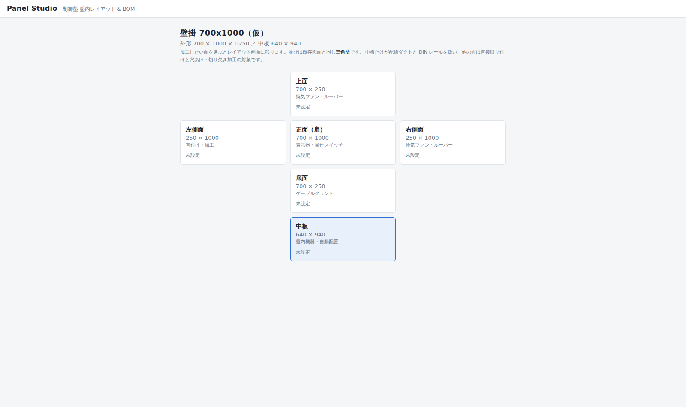

# Panel Studio

制御盤の**盤内レイアウト自動配置**と**BOM 自動生成**を行う Web アプリです。
機器と個数を選ぶだけで、盤面レイアウトと部品表が同時に出ます。

- 100% ブラウザ動作（サーバー不要・インストール不要）
- 出力は **DXF**。AutoCAD LT でもそのまま開けます
- 開発環境: Node.js + React + TypeScript (Vite)

## 起動方法

```bash
npm install     # 初回のみ
npm run dev     # 開発サーバー → http://localhost:5173
```

配布用ファイルを作る場合:

```bash
npm run build:single   # release/panel-studio.html を出力（HTML 1ファイル）
```

出力された HTML 1ファイルを共有フォルダに置けば、ダブルクリックで開けます。

## 設計の要点

| 項目 | 方針 |
| --- | --- |
| 機器マスタ | **唯一の情報源**。レイアウトと BOM の両方がここを参照し、同期崩れを防ぐ |
| 座標系 | 中板(取付板)の左下を原点、X 右・Y 上、単位 mm |
| CAD 連携 | **DXF 書き出しのみ**。AutoCAD LT は COM/ActiveX 自動化に非対応のため |
| 配置アルゴリズム | 決定論的 greedy。最適詰込みは**あえてやらない**（「主幹は上段・端子台は下段」という人間のルールから外れると使われなくなる） |
| 安定配置 | 手で動かした機器は `pinned` として座標を保持。機器を1台足しても既存配置が組み替わらない |
| クリアランス | 実効値 = `max(グローバル設定, 機器個別のメーカー指定値)`。メーカー指定を下回らせない |
| 奥行き判定 | 「中板上面 → 扉内面」の有効奥行きで干渉を見る。DIN レール取付時はレール高さを加算 |

## 現在の状態

### 面の選択

制御盤の**6面**（上面／左側面／正面（扉）／右側面／底面／中板）から選ぶと、その面の
レイアウト画面に移ります。並びは既存図面と同じ**三角法**です。



| 面 | 扱い |
| --- | --- |
| 中板 | 配線ダクト＋DIN レール。自動段組みの対象 |
| それ以外の5面 | 直接取り付けのみ。穴あけ・切り欠き加工の対象 |

### 動くもの

- 盤・ダクト・クリアランスの設定 UI（変更が即座に盤面へ反映）
- 機器の選択（**折りたためるツリー**＋絞り込み検索）と個数指定、DIN／直付けの切り替え
  - その面に取り付けられない機器はツリーに出ません
- 横ダクト段組みでの自動配置
  - **段の高さを中身から決める**（段ごとに可変）／全段そろえる の2モード
  - **DIN 取付・直接取付とも段の中で上下中央合わせ**
- 面の SVG 表示（ホイールで拡大縮小、ドラッグで移動、機器ドラッグで手動配置）
- **加工（穴あけ・切り欠き）**
  - 押ボタンや表示器を置くと、**φ22 の穴や角穴が座標付きで自動で出る**
  - 自動で出ない加工は手で追加・編集できる
  - 同じ寸法ごとの集計も表示
- 違反表示（段の高さ不足・幅不足・奥行き干渉・扉裏の突出超過・機器同士の重なり）
- BOM 表示（機器本体＋派生部品：DIN レール切断長、ダクト定尺本数と端材、エンドストッパ、取付ネジ）
- **CSV 書き出し**（部品表／加工リスト）


### 未実装（次の段階）

- **部品追加画面**（CAD ファイルから機器を登録し、四角ではなく実形状で描く）
- **My部品表**（担当者ごと・共有フォルダの JSON で全員が見られる）
- ダクトレイアウトの残り5パターン（縦ダクト両サイド／田の字／ゾーン分割／端子台最下段／カスタム）
- BOM の xlsx 出力
- My設定ファイル（`*.panelstudio.json`）の書き出し・読み込み
- DXF 取り込みによる盤マスタの自動蓄積
- Undo / Redo

## CSV 書き出しについて

- **部品表 CSV** と **加工リスト CSV** の2種類を出します。
- 文字コードの既定は **Shift-JIS (CP932)**。国内 ERP は Shift-JIS 指定のことが多いためです。
  UTF-8（BOM 付き）にも切り替えられます。
- 区切り文字と見出し行の有無も切り替えられます。ERP の取込仕様が判明したら、
  **コードを触らず設定を変えるだけ**で合わせられる作りにしてあります。
- 改行は ERP 取込で要求されることが多い CRLF です。
- ダウンロードのファイル名は ASCII のみで組み立てています。非 ASCII を含む名前は
  ブラウザ・OS のロケール次第で丸ごと捨てられ `download` になることがあるためです。

## DXF 書き出しについて

**一旦取り下げています。** 実装済みでしたが、仕様の見直しにより削除しました。
コードは Git 履歴に残っているので復活できます（DXF R12 / 実寸 mm / Shift-JIS / レイヤ名は設定可）。

## データについて

⚠ `src/data/` のサンプル寸法は**すべて仮値**です。実案件で使う前に、メーカーのカタログと
図面データで実寸を確認して差し替えてください。

⚠ メーカー配布の DXF/DWG は**再配布が禁止**されています。このリポジトリには寸法（数値）
だけを持ち、図面ファイルは同梱しません。各自がメーカーサイトからダウンロードして
アプリに読み込む運用にします（`.gitignore` で `*.dxf` / `*.dwg` を除外済み）。

## ドキュメント

- [仕様レビューと技術判断](docs/01-spec-review.md)
- [既存図面から読み取った作図規則](docs/02-drawing-conventions.md)
- [引き継ぎ用の元仕様書](docs/00-original-spec.md)

※ `docs/01-spec-review.md` は検討時点の記録のため、取付板を「基板」と表記しています。
実際の図面の表記に合わせ、以降は**「中板」**を正式な呼称とします。
