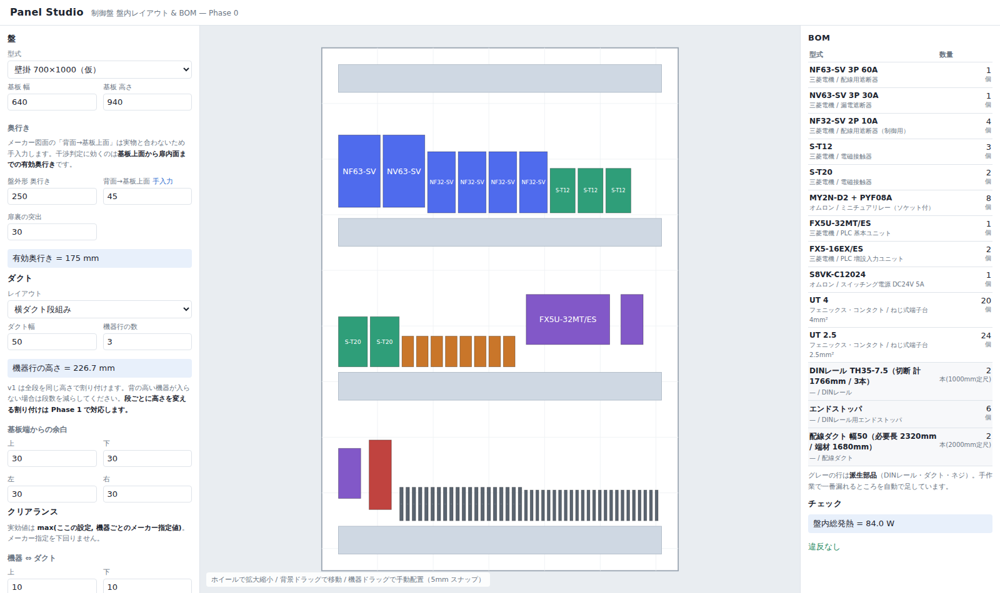

# Panel Studio

制御盤の**盤内レイアウト自動配置**と**BOM 自動生成**を行う Web アプリです。
機器と個数を選ぶだけで、盤面レイアウトと部品表が同時に出ます。

- 100% ブラウザ動作（サーバー不要・インストール不要）
- 出力は **DXF**。AutoCAD LT でもそのまま開けます
- 開発環境: Node.js + React + TypeScript (Vite)

## 起動方法

```bash
npm install     # 初回のみ
npm run dev     # 開発サーバー → http://localhost:5173
```

配布用ファイルを作る場合:

```bash
npm run build:single   # release/panel-studio.html を出力（HTML 1ファイル）
```

出力された HTML 1ファイルを共有フォルダに置けば、ダブルクリックで開けます。

## 設計の要点

| 項目 | 方針 |
| --- | --- |
| 機器マスタ | **唯一の情報源**。レイアウトと BOM の両方がここを参照し、同期崩れを防ぐ |
| 座標系 | 基板(取付板)の左下を原点、X 右・Y 上、単位 mm |
| CAD 連携 | **DXF 書き出しのみ**。AutoCAD LT は COM/ActiveX 自動化に非対応のため |
| 配置アルゴリズム | 決定論的 greedy。最適詰込みは**あえてやらない**（「主幹は上段・端子台は下段」という人間のルールから外れると使われなくなる） |
| 安定配置 | 手で動かした機器は `pinned` として座標を保持。機器を1台足しても既存配置が組み替わらない |
| クリアランス | 実効値 = `max(グローバル設定, 機器個別のメーカー指定値)`。メーカー指定を下回らせない |
| 奥行き判定 | 「基板上面 → 扉内面」の有効奥行きで干渉を見る。DIN レール取付時はレール高さを加算 |

## 現在の状態（Phase 0）

動くもの:

- 盤・ダクト・クリアランスの設定 UI（変更が即座に盤面へ反映）
- 機器の選択と個数指定、DIN レール／直付けの切り替え
- 横ダクト段組みでの自動配置
- 盤面の SVG 表示（ホイールで拡大縮小、ドラッグで移動、機器ドラッグで手動配置）
- 違反表示（行高さ不足・幅不足・奥行き干渉）
- BOM 表示（機器本体＋派生部品：DIN レール切断長、ダクト定尺本数と端材、エンドストッパ、取付ネジ）



未実装（次の段階）:

- **段ごとに高さを変える割り付け**（現在は全段同じ高さ）
- ダクトレイアウトの残り5パターン（縦ダクト両サイド／田の字／ゾーン分割／端子台最下段／カスタム）
- DXF 書き出し、BOM の xlsx / CSV 出力
- My設定ファイル（`*.panelstudio.json`）の書き出し・読み込み
- DXF 取り込みによる盤マスタの自動蓄積
- Undo / Redo

## データについて

⚠ `src/data/` のサンプル寸法は**すべて仮値**です。実案件で使う前に、メーカーのカタログと
図面データで実寸を確認して差し替えてください。

⚠ メーカー配布の DXF/DWG は**再配布が禁止**されています。このリポジトリには寸法（数値）
だけを持ち、図面ファイルは同梱しません。各自がメーカーサイトからダウンロードして
アプリに読み込む運用にします（`.gitignore` で `*.dxf` / `*.dwg` を除外済み）。

## ドキュメント

- [仕様レビューと技術判断](docs/01-spec-review.md)
- [引き継ぎ用の元仕様書](docs/00-original-spec.md)
